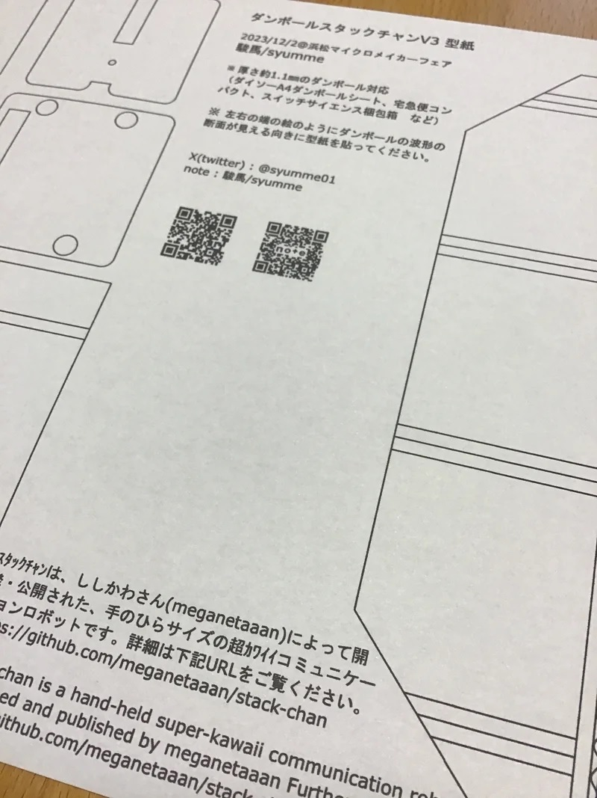

# stack-chan_cardbord_patternV3
 Cardbord pattern papaer V3 for Stack-chan

# 概要

　ダンボールでｽﾀｯｸﾁｬﾝを作るための型紙（写真）です。[Hamamatsu Micro Maker Faire 2023の小少創作室ブース](https://makezine.jp/event/makerfaire/hmmf2023/)で配布したものになります。

# 型紙
[Stack-chan_Cardboad_PatternV3.pdf](pdf/stack-chan_cardbord_patternV3.pdf)

pdfフォルダ内にあります。  
用紙サイズはA4で、倍率は拡大縮小せず等倍（100％）で印刷してお使いください

# 使用するダンボール
1㎜強の厚みのダンボールを想定しています。
異なる厚みのものを使う場合は寸法を調整してください。
これまで私が使ったダンボールは以下となります。
- ヤマト運輸 宅急便コンパクト
- スイッチサイエンスの梱包箱
- [ダイソー A4ダンボールシート5枚入り](https://jp.daisonet.com/products/4550480102443)（110円、フリマ用品）

# 作り方
下記ページとなります。  
[note「ダンボール＃ｽﾀｯｸﾁｬﾝV3(ブイ スリャァァァ)」](https://note.com/syumme/n/ncdc4fd9133be)

# ｽﾀｯｸﾁｬﾝについて
ｽﾀｯｸﾁｬﾝは[ししかわさん](https://github.com/meganetaaan)によって開発・公開された、手のひらサイズの超ｶﾜｲｲコミュニケーションロボットです。詳細は下記URLをご覧ください。 

Stack-chan is a hand-held super-kawaii communication robot 
developed and published by meganetaaan Further details are: 

https://github.com/meganetaaan/stack-chan

# LICENSE
[Apache 2.0](LICENSE-2.0.txt)

# Author
[syumme](https://github.com/syumme)